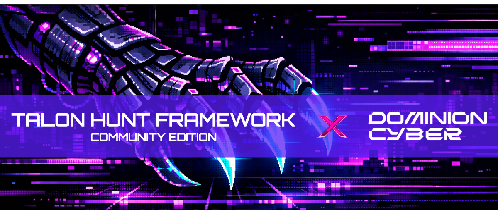

<p align="center">
    <picture>
        
    </picture>
</p>

---

# Overview

Talon Hunt Framework is a collection of saved searches designed for native import into CrowdStrike Falcon, enabling streamlined threat hunting, detection engineering, and incident response activities with zero external dependencies.

Talon leverages the power of CrowdStrike Query Language (CQL) to provide analysts and engineers with a standardized framework for building, organizing, and maintaining detection content. By establishing a common language across security teams, Talon supports proper CI/CD pipelines for hunt and detection workflows, ensuring queries remain consistent, version-controlled, and production-ready.

## Key Capabilities

- **Performance-Optimized Queries:** All queries are written to be performant by default, reducing overhead so even complex, multi-condition searches execute efficiently at scale

- **Search Accelerators:** Enable rapid triage of known compromised hosts or users, helping analysts quickly gauge the scope and severity of malicious activity

- **Standardized Field Conversions:** Transform raw telemetry into human-readable output for faster analysis

- **Join Utilities:** Simplify correlation of multiple event types into unified investigative views

- **Telemetry Demystification:** Purpose-built transformations make esoteric or obscure Falcon event data accessible to analysts at any skill level

- **Query Cradle Library:** Ranging from basic single-event searches to sophisticated multi-event correlation queries that link related but disparate events into cohesive views

Whether you're hunting for lateral movement, investigating credential abuse, or building net-new detections, Talon accelerates time-to-insight across your security operations.

> [!IMPORTANT]
> ## 👁️ Community Group
> Dominion Cyber is in the process of migrating our defender community to a more scalable platform. This community will bring together like-minded defenders to collaborate, share insights, and support one another.
>
> ### What to Expect
> Membership will be limited to vetted individuals only. To join, applicants must either:
> - Receive a vouch from a current active member
> - Complete a screening process
>
> This approach helps maintain the integrity of the community and reduces the risk of exposing sensitive information.

## Community Edition

The Community Edition of Talon Hunt Framework includes conversions from popular community rule frameworks such as Sigma, Elastic Detection Rules, and others, bringing battle-tested detection logic directly into your Falcon environment. Beyond pre-built conversions, Talon provides a conversion framework that simplifies the process of translating external rule formats into optimized CQL, enabling teams to rapidly onboard detection content from across the security community.

> [!IMPORTANT]
> ## 🛡️ Enterprise Support Available
> Dominion Cyber offers the **Talon Hunt Framework** for organizations looking for a **maintained instance of Talon**, along with associated **threat intelligence, detection and hunt feeds**.
>
> **Interested in enterprise support?**  
> Reach out via the [Contact page](https://www.dominioncyber.net/) to get started.=

## Useful Links

- Talon Documentation - ⚠️ WORK IN PROGRESS
- Talon CE Quick Start Guide - ⚠️ WORK IN PROGRESS
- Talon Community - ⚠️ WORK IN PROGRESS
- Fundamentals Knowledge Check - ⚠️ WORK IN PROGRESS
- Contributing Guide - ⚠️ WORK IN PROGRESS
- [Community Detections/Sigma/Threat Hunts](https://github.com/DominionCyber/talon_hunt_framework/tree/main/community_detections/sigma/threat_hunting)
- [Talon Hunt Framework](https://github.com/DominionCyber/talon_hunt_framework/tree/main/talon_hunt_framework)

## Contact Dominion Cyber

Please visit the [contact page](https://www.dominioncyber.net/) on the Dominion Cyber official website to get in touch.

## Licensing

```
Copyright 2026 Dominion Cyber

Licensed under the GNU Affero General Public License (AGPL), Version 3.
You may not use this file except in compliance with the License.
You may obtain a copy of the License at

    https://www.gnu.org/licenses/agpl-3.0.html

Unless required by applicable law or agreed to in writing, software
distributed under the License is distributed on an "AS IS" BASIS,
WITHOUT WARRANTIES OR CONDITIONS OF ANY KIND, either express or implied.
See the License for the specific language governing permissions and
limitations under the License.
```

Talon Hunt Framework is created and maintained by the **Dominion Cyber** team.
